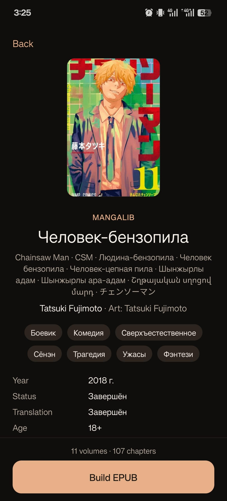
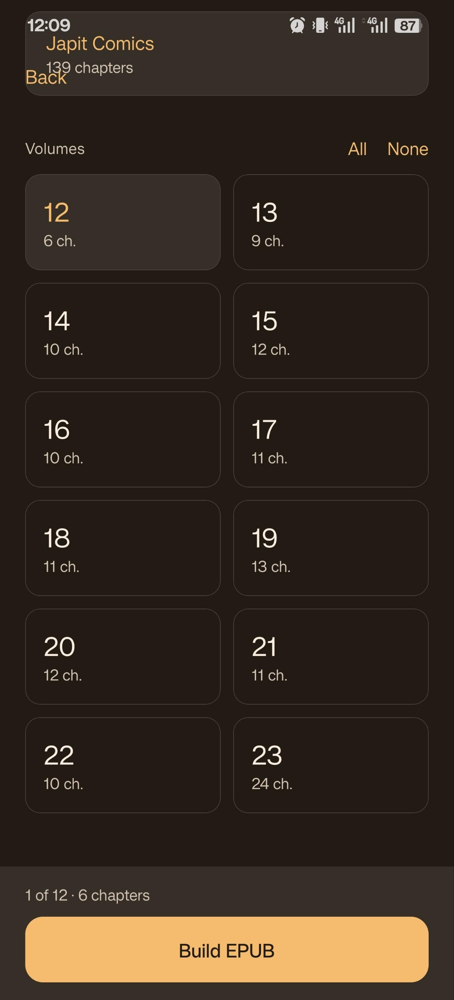

# REPUBer

Мобильное приложение которое позволяет искать ранобэ / мангу, собирать EPUB и сохранять его на устройстве.

   

Источники лежат в `ranobelib-epub/src/cores`. Приложение их только вызывает. Готовые файлы на телефоне пишутся в `Documents/RanobeLibrary`. На Android книгу можно открыть в установленной читалке или отправить через меню «Поделиться».

## Имплементированные ядра

| Название | Поиск | Информация | Загрузка |
|---|---|---|---|
| MangaLib | ✅ | ✅ | ✅ |
| RanobeLib | ✅ | ✅ | ✅ |
| MangaHub | ✅ | ✅ | ✅ |
| Yamiko | ✅ | ✅ | ✅ |

## Разработка

Нужен Node.js 20 или новее.

```bash
npm install
npx expo start
```

- `a` в терминале Metro запускает Android, если на машине уже есть собранное приложение.
- `npm run web` открывает веб-версию. В браузере библиотека хранится в IndexedDB, а не в файлах телефона.
- `npm run android` собирает отладочную сборку и ставит её на устройство или эмулятор. Команда сама вызывает Android SDK и Gradle.

После первой сборки правки только в JavaScript и TypeScript подхватывает Metro. Заново собирать натив нужно, если менялись `app.json`, плагины или нативные зависимости.

## Важно

Проект не связан с ranobelib. Используйте его для личного чтения и уважайте права авторов и переводчиков.

## Послесловие

Мне самому нужен был подобный софт, поскольку читать хочется, а источников для скачивания любимых ранобэ нигде нормально не найти, так что вот так :)
